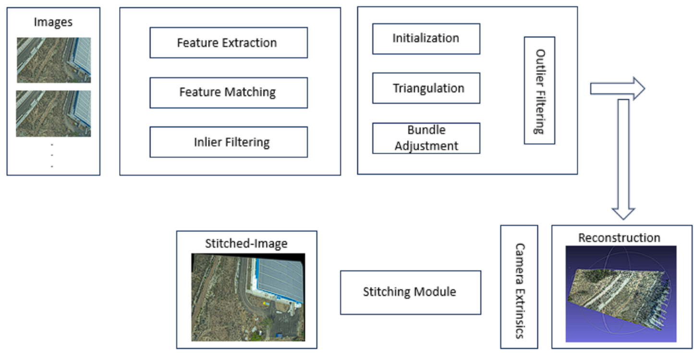

# GalaxEye-Optical-Stitching-Pipeline

## Overview

This repository contains an automated pipeline for stitching optical microscopy images. The pipeline takes multiple overlapping images as input and produces a single, high-resolution composite image as output

</img> 

## Features

- End-to-end pipeline for automated image stitching
- Parallel processing for improved performance
- Configurable stitching parameters
- Saves orientation (Euler angles) and translation (Latitude, Longitude, Altitude) parameters
- Generates and saves the corresponding characteristic curve
- Produces a 3D sparse point cloud with animated rotation across horizontal and vertical axes

## Enviornment Setup

1. Clone this repository
2. Create a docker image <code> docker build -t image-name . </code>
3. Run the docker image <code> docker run -it image-name </code>
4. Run <code> pip install -r Requirements.txt </code>
5. Run the Setup file <code> python3 setup.py build </code>
6. Exit docker

## Run the pipeline

1. Create a <code> data </code> directory and place the JPG/TIFF/PNG images in <code> data/{mission_name}-{flight_num}-{frame_number}/images </code> path 
2. Copy the config.yaml file from <code> config_files </code> directory into <code> data/{mission_name}-{flight_num}-{frame_number} </code> path
3. Run for local mapping <code> docker run -it -v /home/datademon/Desktop/Alik/galax_spip_v2/data:/data image-name /bin/sh -c "bin/opensfm_run_all /data/{mission_name}-{flight_num}-{frame_number}" </code>  
4. In the <code> data/{mission_name}-{flight_num}-{frame_number}/saves </code> directory, the final stitched image is saved
5. In <code> saves/EA </code> Euler Angles, LLA (in .csv format) and the plots are stored
6. In <code> saves/PC </code> V/H axis based 3D Sparse Point Cloud animations are stored     

## Implementation Inspiration

1. <a href='https://github.com/mapillary/OpenSfM'> OpenSfM </a>
2. <a href="https://github.com/freddieb/panoramic-image-stitching"> Panorama-Image-Stitching </a>
